# Mendix Push Notifications

> BETA  
> This module is currently in beta; the APIs described below are subject to change.

Push Notifications let your application notify a user of events even when the user is not actively using the application. This is a native capability provided by both Android and iOS devices and made available via Google Cloud Messaging (GCM) and Apple Push Notifications service (APNs). This project is meant to make it easy for Mendix developers who want to include Push Notifications capability into their Mendix hybrid mobile application.

## Overview

In general, a Mendix Push Notifications solution consists of two parts: the `PushNotifications` module and the `PushNotifications` widget (depicted in the picture as "Custom widget"). The module is the "server-side" and responsible for sending push notifications to GCM/APNs which in turn will send the notifications to end-user devices. The widget resides in the hybrid mobile (PhoneGap) app. It is responsible for the application's interaction with GCM/APNs (via a PhoneGap Push Plugin); both registering the devices with these services and handling push notifications received from them.


## Pre-requisites

- Mendix platform account (You can sign up [here](https://www.mendix.com/try-now/))
- Mendix Modeler version 6.1.0 or newer (You can download it [here](https://appstore.home.mendix.com/link/modeler))
- Mobile device (To get started, we recommend an Android device connected to your development machine by data cable)
- [PhoneGap Build](https://build.phonegap.com/) account

## Supported Platforms

- Android 4.0 and newer
- iOS 7.0 and newer

## Limitations and known issues

This project assumes that the mobile app and the "back-end" part will be co-located in the same application.

### At this moment this project does not support:
- Offline hybrid mobile
- Anonymous access
- Multiple devices per user

### "Error parsing JSON" when sending GCM messages
- This is a known issue (issue #16). We will address it in a next release.


## Contributing

For more information on contributing to this repository visit [Contributing to a GitHub repository](https://world.mendix.com/display/howto6/Contributing+to+a+GitHub+repository)!

## Implementation Guide

This guide will walk you through the steps needed to implement push notifications in your application:
- Importing the `PushNotifications` module.
- Adding the Push Notification widget and administrator pages.
- Updating several project files with the necessary dependencies.
- Obtaining GCM/APNs access/credentials and configuring them to your application.
- Building the hybrid mobile package.

### Step 1 - Create an mpk of the `PushNotifications` module

We need to extract the module from this project before starting with the implementation. Walk through the following steps:

1. Clone this project or download it as ZIP and extract it.
2. Open the `PushNotifications.mpr` which is located in the `test` directory in the root of the project with a Mendix Modeler.
3. Right-click on the `PushNotifications` module (inside Project Explorer pane) and select `Export module package...`. A dialog will appear informing you of the existence of references to other modules; choose the 'Continue exporting' option. The next dialog will allow you to choose which resources to export along with the module; make sure all files are selected, confirm, and then save the mpk file.


### Step 2 - Import the `PushNotifications` module

Import the mpk file created in Step 1 into your Mendix project. To do this, right-click on an empty space on the Project Explorer pane, select `Import module package...`, choose the mpk file, and add it as a new module. While importing you may get a dialog explaining that some project files will be overwritten; you can just click `OK` here. After importing the module, your error dock will inform you that entity access is out of date; double-click on the error, and then click on `Update security` at the top of the domain model pane to fix this error.


### Step 3 - Install module dependencies

First, open your existing Mendix project (or create a new one). The `PushNotifications` module has two dependencies: `CommunityCommons` and `Encryption` module. Include these two dependencies by downloading them from the App Store; you can reach it by clicking on the `App Store` button on the right side of the menu bar of the modeler.  While importing you may again get a dialog about overwriting project files, which you can confirm by clicking the `OK` button.

> Note: Older versions of the [Encryption module] (https://appstore.home.mendix.com/link/app/1011/Mendix/Encryption) will trigger errors because it contains a reference to a non-existent layout. Fix it by assigning the master layout of the `Encryption.ResponsiveLayout_Certificate` layout to another layout (in this specific use case it is not really important which layout is used). This does not apply to version 1.3.1 and higher.
>
> 

### Step 4 - Update component.json file

Find the `theme\components.json` file in your project directory. This file contains (among others) the dependencies of the to-be-created hybrid mobile application. Update `theme\components.json` by adding `"widgets/pushNotifications/lib/PushNotification.js"` as an element of the `js` array so it would look like this:

```
{  
   "files":{  
      "css":[  
         "lib/bootstrap/css/bootstrap.min.css",
         "mxclientsystem/mxui/ui/mxui.css",
         "styles/css/lib/lib.css",
         "styles/css/custom/custom.css"
      ],
      "js":[  
         "mxclientsystem/mxui/mxui.js",
         "widgets/pushNotifications/lib/PushNotification.js"
      ]
   },
   "cachebust":"{{cachebust}}"
}
```

You can find more information about the `components.json` file [here](https://world.mendix.com/display/refguide6/Customizing+Hybrid+Mobile+Apps).

### Step 5 - Update index.html file

Update `theme/index.html` to include the following reference to this JavaScript library:

```
<script type="text/javascript" src="widgets/pushNotifications/lib/PushNotification.js"></script>
```


### Step 6 - Include the push notifications snippet in the application's layouts

To function properly, the widget should be placed inside a layout which is exclusively applied to mobile pages (i.e. mobile-specific). For example, the `Phone_Top` layout in the `NavigationLayouts` module is a good candidate for this purpose. You can do this by drag-and-dropping the `PushNotification_Snippet` snippet (located in `_USE ME` folder in the `PushNotifications` module) into your mobile-specific layout. Please note that viewing pages which include the Push Notifications widget within the browser will prevent the page from being loaded correctly; we are aware of this issue and will provide a solution in the future.


### Step 7 - Start connectors from your After Startup microflow

The PushNotifications module contains a microflow named `AfterStartup_PushNotifications` which will start the connectors for GCM and APNs for you.
When you include the PushNotifications module in your project, you will need to make sure this microflow is explicitly invoked after startup of your app.
If your project uses Mendix SSO, most likely the `AppCloudServices.StartAppCloudServices` microflow is set to execute after startup. Please refer to the [reference guide] (https://world.mendix.com/display/mendixcloud/Integrate+your+app+with+Mendix+SSO) for details.

Change your startup microflow to a custom microflow where you call both after startup microflows.


### Step 8 - Set up the administration pages

Add the `PushNotifications_Administration` page to the project navigation. This page contains four tabs: `Messages`, `Devices`, `Apple`, and `Google`. The `Apple` and `Google` tabs are used to configure your application to be able to reach the respective services (APNs and GCM) later on. The `Devices` tab contains a list of all devices registered with the application and is useful for testing purposes. The `Messages` tab shows all the messages that are queued either because they were sent using the `QueueMessage` action or because previous attempts to send them failed.

> Note: don't forget to set the `Project security` -> `User roles` to include the `PushNotifications.Administrator` role as part of the main `Administrator` role and the `PushNotifications.User` role as part of the main `User` role.
>
> 

At this point you can deploy your application to the Mendix cloud. If you are using a Free App, simply click the `Run` button.

> You should make sure that the `Encryption.EncryptionKey` constant has a value before you start the application. If the value is not set, you will get a NullPointerException when you try to send a notification to APNs.
>
> If you are using a Free App, you should set a default value for the constant in the model. Otherwise, you can configure the constant value in the Mendix Cloud Portal.


### Step 9 - Set up access to APNs and GCM

Set up access to APNs and GCM and configure them in your application. Note that starting with GCM is recommended because it is significantly less complicated than setting up APNs.

See [Setting up Apple Push Notification Server](#setting-up-apple-push-notification-server) and [Setting up Google Cloud Messaging Server](#setting-up-google-cloud-messaging-server) for the details.

### Step 10 - Build the hybrid mobile application

You will need to build the hybrid mobile application. Refer to the [Publishing a Mendix Hybrid Mobile App how-to] (https://world.mendix.com/display/howto6/Publishing+a+Mendix+Hybrid+Mobile+App+in+Mobile+App+Stores) to get the explanation on how to do this. Note that you should opt to download the PhoneGap Build package instead of directly publishing it. This is necessary because we need to include a PhoneGap plugin which is used by this module in the hybrid mobile application.

Once you have downloaded the hybrid mobile project file, extract it and include the required PhoneGap plugin by adding the following line to the `config.xml` file:

```
<gap:plugin name="com.phonegap.plugins.pushplugin" version="2.5.0" />
```

You can proceed by repackaging the project into a zip file and using PhoneGap Build to generate the files for Android and iOS.

For more information about PhoneGap Build, you can refer to their [documentation](http://docs.build.phonegap.com/en_US/index.html).

> Note that a free PhoneGap Build account is limited to a single application, whereas paid plans support multiple applications. As a consequence, you may need to delete an existing app from your PhoneGap build environment in order to create a new one.

## Testing The Implementation

Once you finish implementing the steps described previously, you will want to test whether everything works correctly. This can be done easily using the administration pages that should have been included in your application during [step 7](#step-7---set-up-the-administration-pages) of the implementation guide. Follow these steps to send a push notification to a device:

### Step 1 - Log in as administrator to the web (desktop) application

Open your application in the browser and log in as administrator (e.g. `MxAdmin`).

### Step 2 - Create a user account for a mobile user

To be able to log in into your hybrid mobile application, you will need to create a new user. Typically, this can be done from the administration pages of your application.

### Step 3 - Log in to your hybrid mobile application

Open your hybrid mobile app and log in to it.

### Step 4 - Open the Push Notifications administration page

Back in the administrator view of your web application, navigate to the `Device Overview` tab in the Push Notifications administration page. Here you should see one device already having been registered, which is the device that you used to log in to your hybrid mobile application. Continue by selecting the device and press the `New Message` button.


### Step 5 - Send a message

Fill in the title and the message in the form and press `Send immediate` button. Your device should receive a new push notification. If your hybrid mobile app is currently running in the foreground, the notification will be displayed in the app. Otherwise, it will be shown as a standard push notification.


## APIs

This is a list of Java actions that can be called by your application to send push notifications. They are located in the `_USE ME/Send Messages` folder.

|Java action name       |Description                                                    |
|-----------------------|---------------------------------------------------------------|
|SendMessage            |An action to send a message to GCM/APNs immediately            |
|QueueMessage           |An action to send a message to GCM/APNs using a queue          |

> Note: for sending queued messages to work, you need to ensure that the scheduled event `PushQueue` is active. For TAP environments you will need to explicitly activate the scheduled event in the Mendix Cloud Portal. For Free Apps the scheduled events feature is not supported, so a queued message won't be sent.

## Setting up Apple Push Notification Server

In order to proceed you need an Apple developer license and a device running Mac OS X.

We assume that you already have the app signing key with provisioning profile and can freely build and install your mobile app (if not, please refer to [this how-to] (https://world.mendix.com/display/howto6/Publishing+a+Mendix+Hybrid+Mobile+App+in+Mobile+App+Stores#PublishingaMendixHybridMobileAppinMobileAppStores-3.SettingupAppSigningKeys)). Take into account that your App ID should use `Explicit App ID` and have `Push Notifications` turned on so you can receive push notifications with your app.

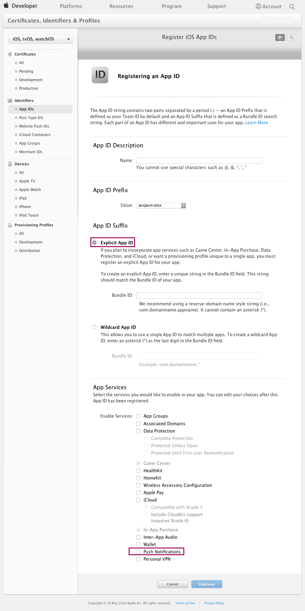

If this is not the case, you need to create new App ID with `Explicit App ID` and `Push Notifications` turned on. After that, you'll need to download the new provisioning profile for this App ID and use it to rebuild the mobile app.

If everything is set up and you can build and deploy your application, you can proceed with setting up the push notifications server.
To establish connectivity between your notification server and the Apple Push Notification service you will need an Apple Push Notification service SSL certificate in `.p12` format.

Follow these steps to obtain an Apple Push Notifications service SSL certificate from Apple:

### Step 1 - Log in to Apple Developer center

Log in to Apple Developer and go to https://developer.apple.com/account/ios/certificate/create

### Step 2 - Choose certificate's type

Choose Push Notification service certificate. As you may see, there are two types of certificates: _development_ and _production_. Note that the development type certificate can only work with the sandbox environment. More about this will be explained later on in this guide.

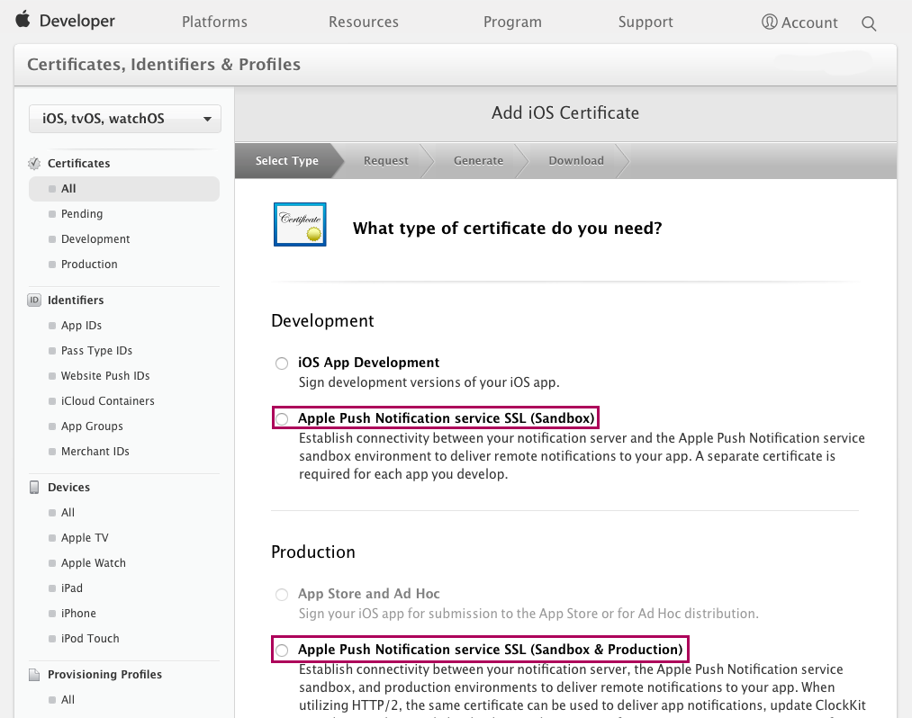

### Step 3 - Select App ID

Pick your App ID from the dropdown list. If your app is not in the list, then you need to check your App ID entity. Most likely the push notification service is not turned on for the app.

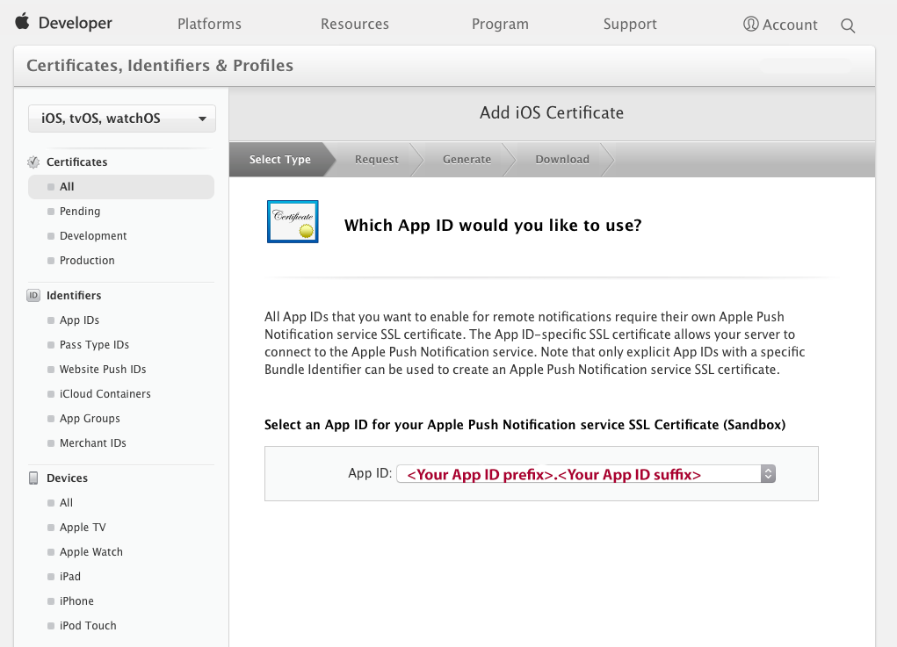

### Step 4 - CSR file

During the next step you should be asked for your CSR file (Certificate Signing Request). You may use the same CSR that you used to create the app signing certificate. If you don't have one, please follow the instructions as shown below.

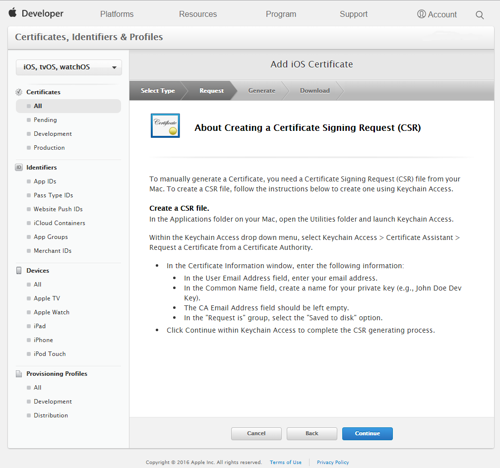

### Step 5 - Download the certificate

Download your Apple Push Notification service SSL certificate and add it to your Keychain.

This certificate needs to be converted into the `.p12` format. If you don’t know how to do this, please refer to [this page]  (https://developer.apple.com/library/ios/documentation/IDEs/Conceptual/AppDistributionGuide/MaintainingCertificates/MaintainingCertificates.html).

### Step 6 - Configure APNs in your application

For the last step you need to configure APNs within your application. This can be done by logging into your application as a user with Administrator role and opening the `Apple` tab of the `PushNotifications_Administration` page that was set up in [step 7](#step-7---set-up-the-administration-pages) of the Implementation Guide.

For this purpose you need to:
-	Add your Apple Push Notification service SSL certificate in `.p12` format
-	Add the server url and port. This is `gateway.sandbox.push.apple.com:2195` for sandbox and `gateway.push.apple.com:2195` for production.
-	Add the feedback url and port. This is `feedback.sandbox.push.apple.com:2196` for sandbox and `feedback.push.apple.com:2196` for production.

> Note: At this moment, multiple configuration objects are not supported; having more than one of these objects will lead to unpredictable behavior. This will be fixed in the near future.

## Setting up Google Cloud Messaging Server

In order to send Google push notifications from this module you need to have set up a Google account with Google Cloud Messaging enabled.
To register for Google Cloud Messaging and configure the service in the app, you will need to perform the following steps.

### Step 1 - Log in to developers console

Open up the Google [developers console] (https://console.developers.google.com) and log in with your Google id.

### Step 2 - Create project

From the dropdown box in the upper-right corner of the page (see screenshot below), click `Create a project` and fill in the project name and project ID for your application. Then click `Create`.

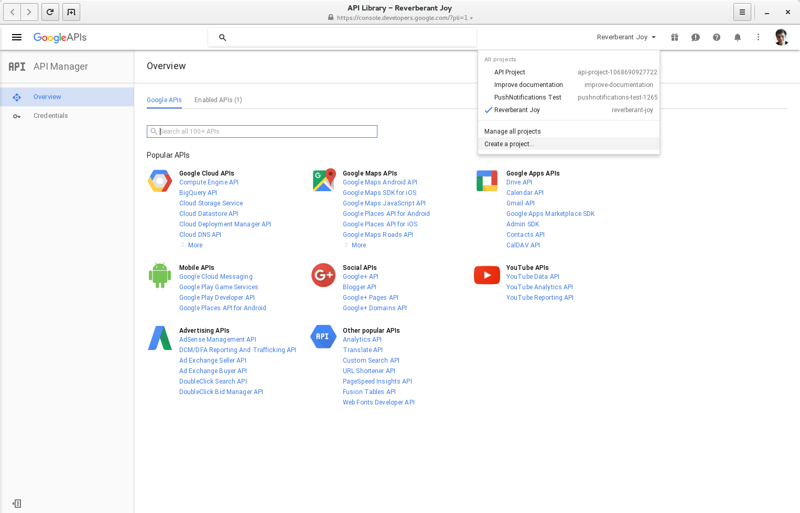
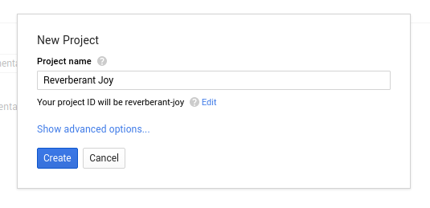

### Step 3 - Enable Google Cloud Messaging

Once created, click the link to the Google Cloud Messaging API (section `Mobile APIs`) and click the `Enable` button.

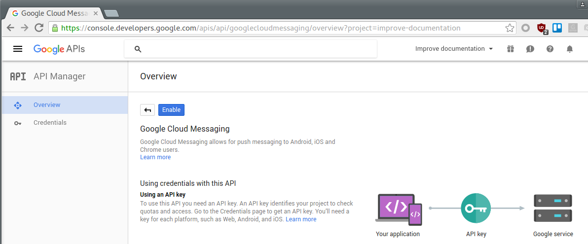

### Step 4 - Adding credentials

Click on the menu option `Credentials`, located on the left hand side under the `API Manager` section.

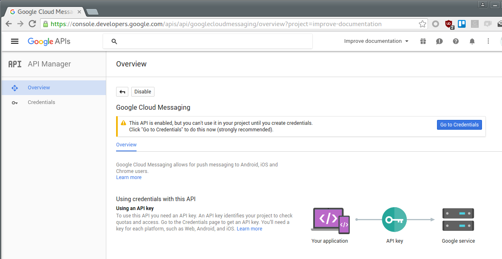

Depending on if you are a new or existing user, you may get a different credential setting page.

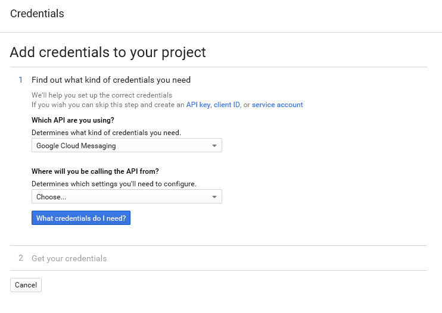

If your page looks like the screenshot above, follow the steps in [section 4a](#step-4a---adding-credentials-as-a-new-user).
If instead your page looks like the screenshot below, follow the steps in [section 4b](#step-4b---adding-credentials-as-an-existing-user).

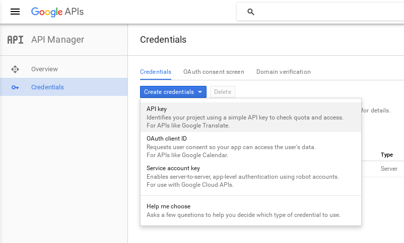

### Step 4a - Adding credentials as a new user

- For the question **Which API are you using?**, select "Google Cloud Messaging".		 
- The next question, **Where will you be calling the API from?**, answer "Web server".

### Step 4b - Adding credentials as an existing user

Click on the `Create credentials` button. You would want to choose an API key of type `Server`.

### Step 5 - Create API key

Choose a name for your key and, optionally, restrict the IP addresses that can connect to the API.

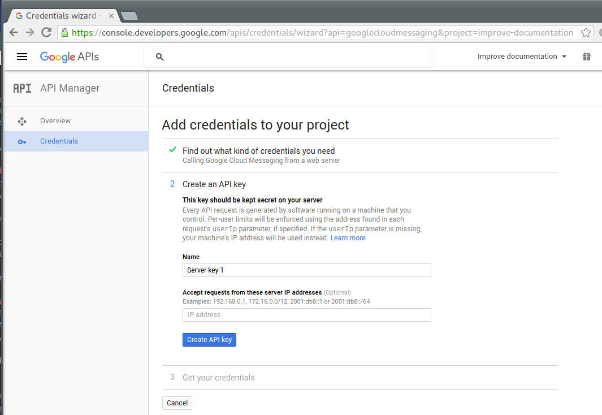

Then, press the `Create API key` button.

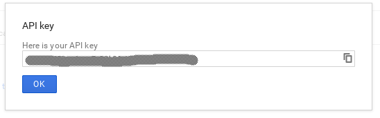

For the next step, you'll need to look up the **project number**. You can find it in your Google project's `Project Information` pane ( ⁝ utilities menu on the top right).

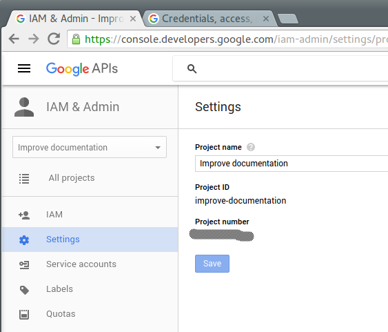

### Step 6 - Configure GCM in your application

Open your Mendix application, log in as an Admin, and open the `PushNotifications_Administration` page. In this page, navigate to the `Google` tab and then the `Configurations` tab. Select the configuration object and click on the `Edit` button if it already exists, or on the `New` button if it does not. For the `DTAP mode` field, choose the option which corresponds to your environment. The `XMPP server` field should have the value `gcm.googleapis.com` whereas the `XMPP Port` field should be `5235`. Enter the **project number** into the `Sender id` field and the API key into the `API Key` field.

> Note: At this moment, multiple configuration objects are not supported; having more than one of these objects will lead to unpredictable behavior. This will be fixed in the near future.

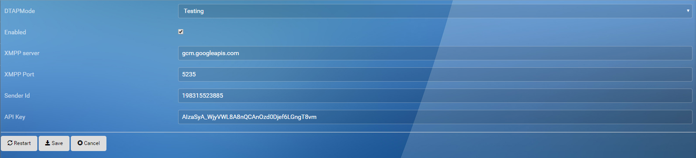

Once the information has been entered, tick the `Enabled` checkbox and press the `Restart` button. From now on your application will always connect to the GCM service on startup.

For more information on setting up your Google API please refer to this article: [Google API Setup] (http://developer.android.com/google/gcm/gs.html).
