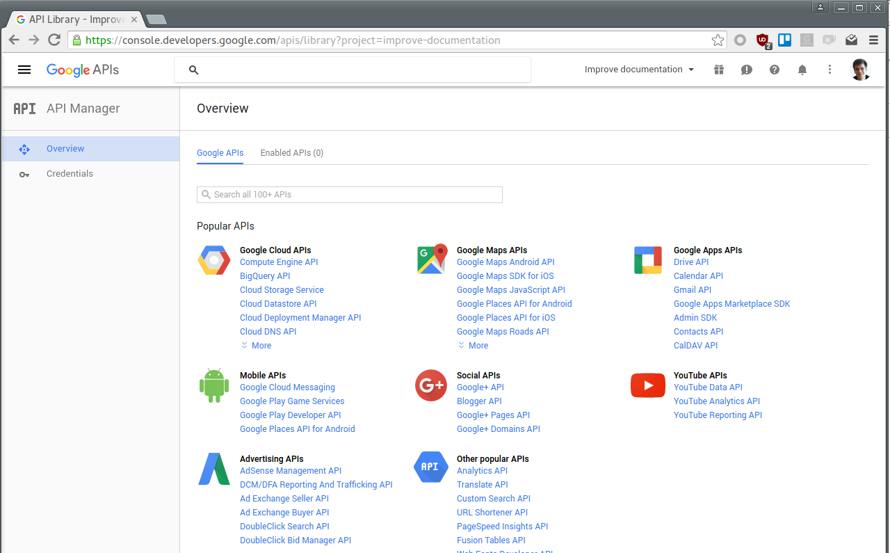

# Mendix Push Notifications

Push notifications let your application notify a user of events even when the user is not actively using the application. This is a native capability provided by both Android and iOS devices and made available for developers by their service offering, respectively named Google Cloud Messaging (GCM) and Apple Push Notification service (APNs). This project is meant to make it easy for Mendix developers who want to include Push Notifications capability into their Mendix hybrid mobile application.

## Overview


In general, a Mendix Push Notifications solution consists of two parts: the MxPushNotifications module and the Push Notification widget. The module is the "server-side" and responsible for sending push notifications to GCM/APNs which in turn will send the notifications to end-user devices. The widget resides in the hybrid mobile (phonegap) app. In general, it has two responsibilities: to make GCM/APNs aware about the particular devices they run in, and to be able to handle push notifications coming from GCM/APNs.

## Limitation

This project assumes that the mobile app and the "back-end" part will be co-located in the same application.

At this moment this project does not support:
- Off-line hybrid mobile
- Anonymous access
- Multiple devices per user

## Contributing

For more information on contributing to this repository visit [Contributing to a GitHub repository](https://world.mendix.com/display/howto6/Contributing+to+a+GitHub+repository)!

## Implementation Guide

### Step 1 - Create an mpk of the PushNotifications module

We need to extract the module from this project before starting with the implementation. Walk through these following steps:

1. Clone this project or download it as ZIP and extract it.
2. Open the `PushNotifications.mpr` which is located in the `test` directory in the root of the project with a Mendix Modeler.
3. Right-click on the `PushNotifications` module (inside Project Explorer pane), select `Export module package...` and save the mpk file.


### Step 2 - Install module dependencies

First, open your existing Mendix project (or create a new one). The Push Notification module has two dependencies: `CommunityCommons` and `Encryption` module. Include these two dependencies by downloading it from the AppStore.

> Note: importing the Encryption module will trigger errors because it contains a reference to a non-existant layout. Fix it by assigning a master layout of `Encryption.ResponsiveLayout_Certificate` page to some other layout (in this specific use case it is not really important which layout is used).
>
> 

### Step 3 - Import the PushNotification module

Import the created mpk file from Step 1 into your Mendix project. To do this, right-click on an empty space on the Project Explorer pane, select `Import module package...`, choose the mpk file, and add it as a new module.


### Step 4 - Update component.json file

Find the `theme\components.json` file in your project. This file contains (among others) the dependencies of the to-be-created mobile hybrid application. Update `theme\components.json` by adding `"widgets/pushNotifications/lib/PushNotification.js"` as an element of the `js` array so it would look like this:

```
{  
   "files":{  
      "css":[  
         "lib/bootstrap/css/bootstrap.min.css",
         "mxclientsystem/mxui/ui/mxui.css",
         "styles/css/lib/lib.css",
         "styles/css/custom/custom.css"
      ],
      "js":[  
         "mxclientsystem/mxui/mxui.js",
         "widgets/pushNotifications/lib/PushNotification.js"
      ]
   },
   "cachebust":"635689412670032000"
}
```

### Step 5 - Update index.html file

Update `theme/index.html`to include the following reference to this javascript library:

```
<script type="text/javascript" src="widgets/pushNotifications/lib/PushNotification.js"></script>
```


### Step 6 - Include Push Notification Snippet in the layouts

Include a push notification snippet on mobile and tablet layouts.


### Step 7 - Set up the administration pages

Add `AppleAdministration`, `GoogleAdministration`, and `Device_Overview` pages to the project navigation. The `Apple Administration` and `GoogleAdministration` pages are used to configure your application to be able to reach the respective services (APNs and GCM) later on. The `Device_Overview` page is useful for testing purpose.

> Note: don't forget to set the `Project security` -> `User roles` to include `PushNotifications.Administrator` role as part as the main `Administrator` role and `PushNotifications.User` role as part of the main `User` role.
>
> 

At this moment you can deploy your application to the cloud. If you are using Free App, simply click the `Run` button.

### Step 8 - Set up access to APNs and GCM

Set up access to APNs and GCM and configure them in your application.

> TODO: link to separate documentation

### Step 9 - Build the hybrid mobile application

You will need to build the hybrid mobile application. Refer to the [Publishing a Mendix Hybrid Mobile App howto] (https://world.mendix.com/display/howto50/Publishing+a+Mendix+Hybrid+Mobile+App+in+Mobile+App+Stores) to get the explanation on how to do that. Note that you should opt to download the app instead of directly publishing it. This is necessary because we need to include a phonegap plugin which is used by this module into the mobile hybrid application.

Once you have the mobile hybrid project file downloaded, extract it and include the required phonegap plugin by adding this line to the `config.xml` file:

```
<gap:plugin name="com.phonegap.plugins.pushplugin" version="2.4.0" />
```

You can proceed by repackaging the project into a zip file and use PhoneGap Build to generate the files for Android and iOS.

## Testing The Implementation

Once you finished implementing the steps described in the previous steps, you might want to test whether everything is already in place. This can be done easily by making use of the administration pages that should have been included into your application. Follow these steps to send a push notification to a device:

### Step 1 - Login to your hybrid mobile application

Open your hybrid mobile app and login to it.

### Step 2 - Login as administrator to the web (desktop) application

Open your application in the browser and login as administrator.

### Step 3 - Open the "Device Overview" page

Navigate to the `Device Overview` page. Here you should see that one device has already been registered, which is the device that you use to login to your hybrid mobile application. Continue by selecting the device and press the `New Message` button.


### Step 4 - Send a message

Fill in the title and the message on the form and press `Send immediate` button. You should see a new notification coming in your device. By default, if your hybrid mobile app is currently active, the message will be displayed in the app. Otherwise, it will be shown as a standard push notification.


## Setting up Apple Push Notification Server

In order to proceed you need an Apple developer license and a device running Mac OS X.

We assume that you already have the app signing key with provisioning profile and can freely build and install your mobile app (if not, please refer to [this howto] (https://world.mendix.com/display/howto50/Publishing+a+Mendix+Hybrid+Mobile+App+in+Mobile+App+Stores#PublishingaMendixHybridMobileAppinMobileAppStores-3.SettingupAppSigningKeys)). Take into account that your App ID should use Explicit App ID and have Push Notification turned on so you could receive push notifications with your app.


If this is not the case, you need to create new App ID with Explicit App ID and Push Notification turned on. After that, you'll need to receive the new provisioning profile with this App ID and rebuild a mobile app.

If everything is set up and you can build and deploy your application, you can proceed with the push notifications server.
To establish connectivity between your notification server and the Apple Push Notification service you will need Apple Push Notification service SSL certificate in `.p12` format.

Follow these steps to obtain Apple Push Notification service SSL certificate from Apple:

### Step 1 - Login to Apple Developer center

Login to Apple Developer and go to https://developer.apple.com/account/ios/certificate/create


### Step 2 - Choose certificate's type

Choose Push Notification service certificate. As you may see, there are two types of certificates: _development_ and _production_. Note that the development type certificate can only work with the sandbox environment. More about this explained later on in this guide.


### Step 3 - Select App ID

Pick your App ID from the dropdown list. If your app is not on the list, then you need to check your App ID entity. Most likely the push notification service is not turned on for the app.

### Step 4 - CSR file

You should be asked for your CSR file (Certificate Signing Request). You may use the same CSR that you used to create app signing certificate. Please follow the instruction within the step description if you don’t have one.

### Step 5 - Download the certificate

Download your Apple Push Notification service SSL certificate and add it to your Keychain.

This certificate needs to be converted into `.p12` format. If you don’t know how to do it, please refer to [this page]  (https://developer.apple.com/library/ios/documentation/IDEs/Conceptual/AppDistributionGuide/MaintainingCertificates/MaintainingCertificates.html).

### Step 6 - Configure APNS on your application

For the last step you need to configure the APNs setting within your application. This can be done by logging into your application as a user with Administrator role and opening the Apple Administration page that was set up in step 7 of the Implementation Guide.

For this purpose you need to:
-	Add your Apple Push Notification service SSL certificate in `.p12` format
-	Add server url and port. For sandbox it is `gateway.sandbox.push.apple.com:2195` and `gateway.push.apple.com:2195` for production.
-	Add feedback url and port. For sandbox it is `feedback.sandbox.push.apple.com:2196` and `feedback.push.apple.com:2196` for production.

## Setting up Google Cloud Messaging Server

In order to send google push notifications from this module you need to have set up a google account with google cloud messaging enabled.
To do so follow these steps to get registered for Google cloud messaging and enter the details into the Mendix screens.

### Step 1 - Login to developers console

Open up the Google [developers console] (https://console.developers.google.com) and login with your Google id.


### Step 2 - Create project

Click new project and fill in the project name and project ID for your application. Then click create. Once created you will see a project number at the top of the screen next to the project ID. Take note of this ID because you will need it later on for our sender ID.


### Step 3 - Enable Google Cloud Messaging

Once created, click the link to the Google Cloud Messaging API and click the Enable button.


### Step 4 - Adding credentials

Click on the menu option credentials, located on the left hand side under the API Manager section.


For the question **Which API are you using?**, select "Google Cloud Messaging".
The next question, **Where will you be calling the API from?**, answer "Web server".


### Step 5 - Create API key

Choose a name for your key and, optionally, restrict the IP addresses that can connect to the API.
Then, press the "Create API key" button.


### Step 6 - Setup Mendix app

Open up your application in Mendix and login as an Admin, so that you can see the menu option "Google admin".
Enter the **project number** into the sender ID field and the API key into the API field. You can find it in your Google project's Settings pane.


Once entered tick the checkbox "Enabled" and press the Restart button. From now on your application will always start the GCM push notification system for you.

For more information on setting up your Google API please refer to this article: (Google API Setup) [http://developer.android.com/google/gcm/gs.html]
