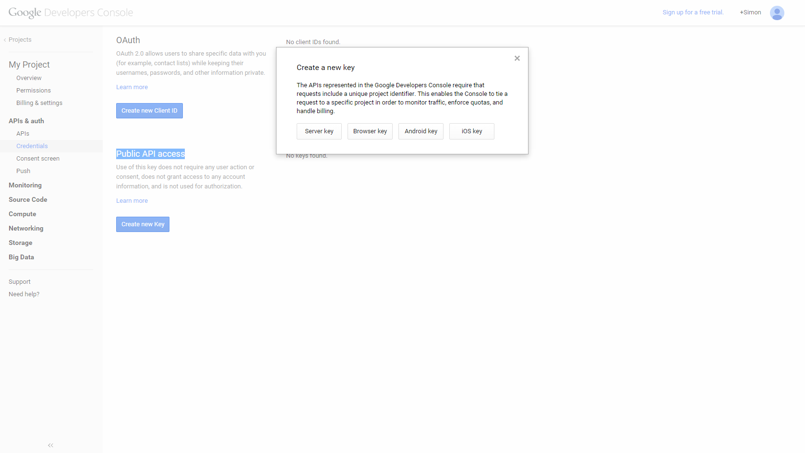

# Mendix Push notifications

This module and widget should be used to implement push notifications for Android, iOS and Windows mobile devices. They have been tested to work on Mendix 5.14.1 and up.

The project contains:

- Directory structure.
- Readme.md file.
- Javascript source.
- XSD for package.xml, to configure properties of the widget, visible inside the Mendix Business Modeler.
- Example project
- Module for sending push notifications
- Custom CSS file to style the push notification html

## Contributing

For more information on contributing to this repository visit [Contributing to a GitHub repository](https://world.mendix.com/display/howto50/Contributing+to+a+GitHub+repository)!

## Description

This project provides all the necessary widgets, Javascript, Java and modules necessary to both send and receive push notifications in a Mendix application. For information on how to build your Mendix apps into PhoneGap applications please refer to this documentation: [Mendix mobile] (https://world.mendix.com/display/refguide5/Mobile)

## Implementation
In order for the push notifications to work in Mendix you must have a few things set up.
- Import module into a 5.14.1 or higher project.
- The microflow AfterStartup_PushNotifications must be included in your after startup flow
- The index.html and components.json must include a reference to a jQuery library.
`<script type="text/javascript" src="js/jquerymin.js"></script>`
- The index.html and the components.json file must include the following reference to this Javascript library
`<script type="text/javascript" src="widgets/pushNotifications/lib/PushNotification.js"></script>`
- The push notification snippet must be included in all layouts for mobile and tablet.
- The pages AppleAdministration, GoogleAdministration and Device_Overview should be added to the navigation.
- You must set up the [Apple server](#setting-up-apple-push-notification-server) and [Google server](#setting-up-google-cloud-messaging-server) using the documentation below
- The PhoneGap push plugin must be included in the config.xml, more information can be found [here](#creating-phonegap-app)
- The widget is connected up to the Google settings object.
- Encryption module from the App Store must be added to the project.

The application included in the test project can be used as reference.

## Components.json
All Mendix applications that want to utilise PhoneGap require a components file. The components file describes all the Javascript and CSS files that need to be loaded when the application is loaded on the device. Below is an example of the components file that would be required for this module.
```
{
    "files": {
        "css": ["lib/bootstrap/css/bootstrap.min.css", "mxclientsystem/mxui/ui/mxui.css", "css/theme.css"],
        "js": ["mxclientsystem/mxui/mxui.js", "js/jquerymin.js", "widgets/pushNotifications/lib/PushNotification.js"]
    },
    "cachebust": "{{cachebust}}"
}
```
For more information on components file please read this documentation:
[Mendix Components](https://world.mendix.com/display/refguide5/Customizing+Hybrid+Mobile+Apps)

The components.json file should be included in the theme folder of your application.


## Sending push notifications

In the module there are two operations to send messages. One which these queue the notifications whereas the other will send them immediately. If you are planning to send several push notifications to different devices at once, then it would be most suitable to use the queued method. If you however simply want to test the sending of messages then just use the send immediate microflow.

In the module there is a device overview page. This will list all of the devices that are currently registered to the application. If you want to send a message to one of these devices you can simply select a device and send a message.

To send a message without using the devices page, simply create a microflow that retrieves the device from a user account and create a message object with the attributes filled. Then simply pass this message to one of the microflows in the use me folder that sends either a message or a list of messages.  

## Setting up Apple Push Notification Server
In order to send push notifications for Apple devices from this module you will need to correctly set up and acquire a certificate from Apple, then add this to the Mendix settings pages.

### Step 1 - Login to members center
Login to the [members center] (https://developer.apple.com/) on developer.apple.com. If you do not have an Apple developers license you will need to purchase it from Apple. When logged in to members center click on "Certificates, Identifiers & Profiles".

This will take you to a screen like this:


### Step 2 - Create APP ID

Click on Identifiers and then click on App IDs.
On the top right there will be a plus button, press this and a dialog like this should appear:


Enter your app ID name and select Explicit App ID. You must select Explicit App ID in order to be able to perform push notifications.
Enter a Bundle ID, this bundle ID must match the bundle ID that you entered during the PhoneGap build phase.

Tick the options push notifications and then click continue.

### Step 3 - Confirm
Click submit


### Step 4 - Creating APS Certificate
Locate your created App ID and click on it. This will expand it out.


Click on Edit and scroll down to the push notifications section. You will see that there are two options one to generate a certificate for development purposes and one for production. For the purpose of this documentation we will generate a development certificate, so we will click on the development create certificate button.


### Step 5 - Generating Certificate
Click continue


You will then be asked to upload a certificate signing request file. In order to create this file please read the following documentation:

[Creating CSR](https://world.mendix.com/display/refguide5/Managing+App+Signing+Keys)

Upload the CSR and then click generate. You will be presented by a screen saying your certificate is ready.
Click done and then click on your certificate from the list and click Download.

### Step 6 - Converting Certificate
Now that we have the certificate from Apple we now need to convert this into p12 format so that we can get it to work with our Mendix application.
This documentation should be helpful for getting your certificate converted:

[Converting Cer to p12](http://docs.build.phonegap.com/en_US/signing_signing-ios.md.html)

### Step 7 - Setting up Mendix APNS
Once you have the p12 certificate you can set up the Apple push notification system in Mendix. Login as an admin to the application and open up the apple admin. In the configuration you will need to upload the p12 file to the Apple administration section. You will also need to include the passcode that you entered when you converted the file to a p12 format.

Click on the enabled checkbox and then click Save. Once saved click the restart button. The apple push notification system will start up and inform you that it has restarted. After you have done this you will be ready to send Apple push notifications. Now that it is enabled the application will always start up when Mendix is started up.


## Setting up Google Cloud Messaging Server
In order to send google push notifications from this module you need to have set up a google account with google cloud messaging enabled.
To do so follow these steps to get registered for Google cloud messaging and enter the details into the Mendix screens.

### Step 1 - Login to developers console
Open up the Google [developers console] (https://console.developers.google.com) and login with your Google id.


### Step 2 - Create project
Click new project and fill in the project name and project ID for your application. Then click create. Once created you will see a project number at the top of the screen next to the project ID. Take note of this ID because you will need it later on for our sender ID.


### Step 3 - Enable Google Cloud Messaging
Once created, click the link to the Google Cloud Messaging API and click the Enable button.


### Step 4 - Adding credentials
Click on the menu option credentials, located on the left hand side under the API Manager section.

For the question **Which API are you using?**, select "Google Cloud Messaging".
The next question, **Where will you be calling the API from?**, answer "Web server".
"

### Step 5 - Create API key
Choose a name for your key and, optionally, restrict the IP addresses that can connect to the API.
Then, press the "Create API key" button.


### Step 6 - Setup Mendix app
Open up your application in Mendix and login as an Admin, so that you can see the menu option "Google admin".
Enter the **project number** into the sender ID field and the API key into the API field. You can find it in your Google project's Settings pane.


Once entered tick the checkbox "Enabled" and press the Restart button. From now on your application will always start the GCM push notification system for you.

For more information on setting up your Google API please refer to this article: (Google API Setup) [http://developer.android.com/google/gcm/gs.html]


## Setting up Windows
Windows requires no additional configuration for push notifications to work. Simply load the application onto a Windows 8 Phone and login to the application. The user's Windows Phone credentials should appear within the device menu.
The notifications for Windows work using a web service, the widget within your application registers the user's unique URL. With the URL the Mendix application can pass a message to this URL.  


## Installing a Windows App
In order to test and publish your Windows 8 applications you will need a Windows developer account that can be obtained from:

[Windows Dev Center](https://dev.windows.com/en-us)

Upon doing so you will receive a Publisher GUID (this can be located under Dashboard > Windows Phone Store > Account). This GUID is needed by PhoneGap in order to sign your applications.

You can download the SDK as well as development tools from [here](https://dev.windows.com/en-us/develop/download-phone-sdk)

Using the "Windows Phone Application Deployment" program you can deploy the XAP which PhoneGap creates onto your Windows device


## Creating PhoneGap app
In order to build a Mendix PhoneGap app that utilises the push notification application there are number of steps that you need to complete before being able to utilise the functionality.

### Step 1 - Login to Mendix home
Open up home.mendix.com and navigate to the project that you wish to build the app for. Once on the project wall for your application click on the publish section.


### Step 2 - App Identifier
Once in the publish section you must enter an app identifier for your application. This is important when setting up an IOS app. Refer to the section about creating an app identifier to find out more information about creating an app identifier and IOS certificate.


### Step 3 - Select Devices
Select the devices that you want to deploy your app to and upload splash screen images for the devices you have selected.

Press the button publish to appstore and you will be asked whether you want to build in the cloud or do it yourself. Choose do it yourself and press the Download Phonegap Build Package.


### Step 4 - Download phonegap.zip

Once the phonegap.zip is downloaded, unzip it into a folder and open up the config.xml. You will need to edit the config.xml so that you can include additional phonegap plugins. The plugin we will need to include is the phonegap [push plugin](https://github.com/phonegap-build/PushPlugin).

The code you will need to include is:
`<gap:plugin name="com.phonegap.plugins.pushplugin" version="2.4.0" />`


### Step 5 - Configure xml
Once you have edited the config.xml you should have everything necessary for your application to work. You will now need to zip up your files and upload the zipped file to [phonegap build](https://build.phonegap.com).


